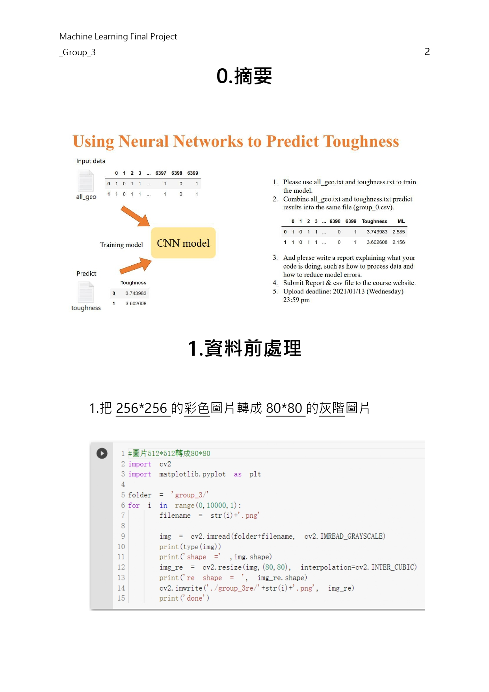
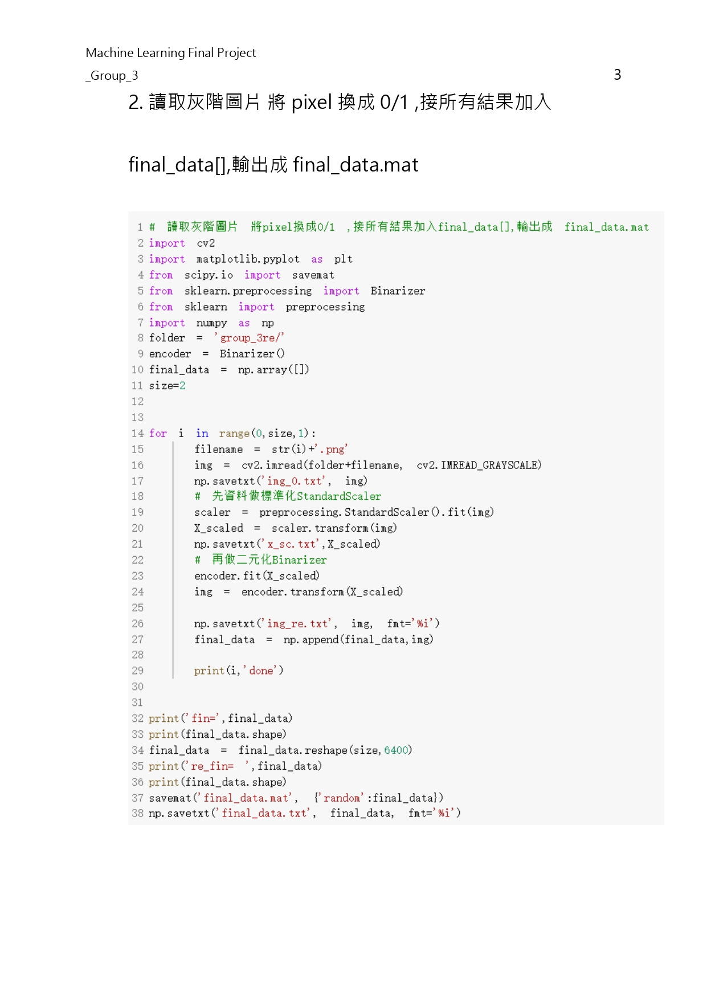
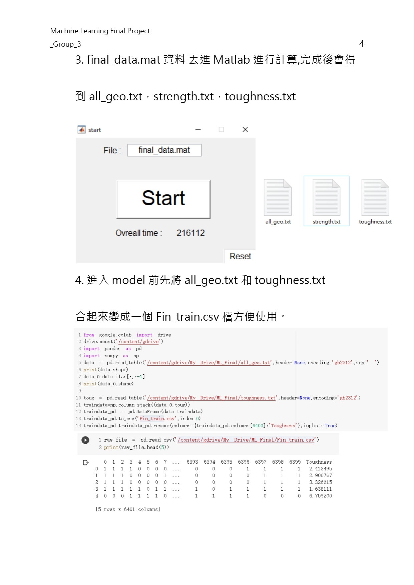
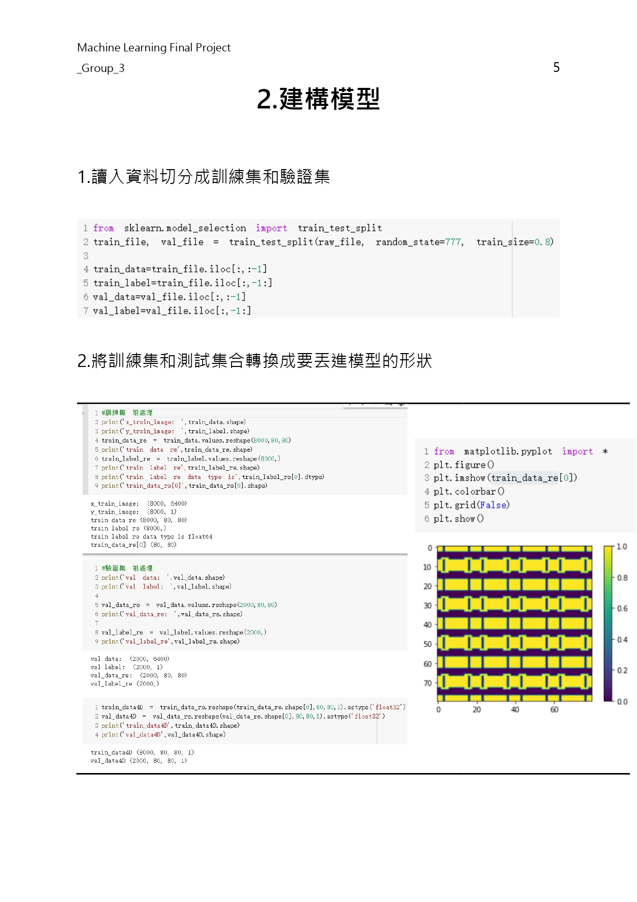
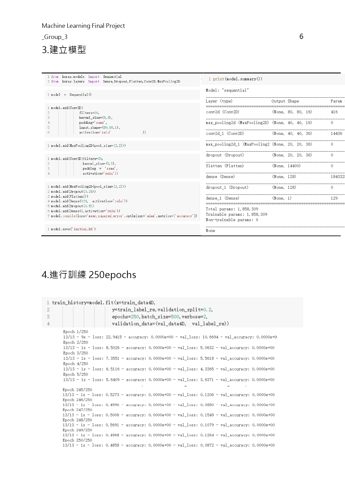
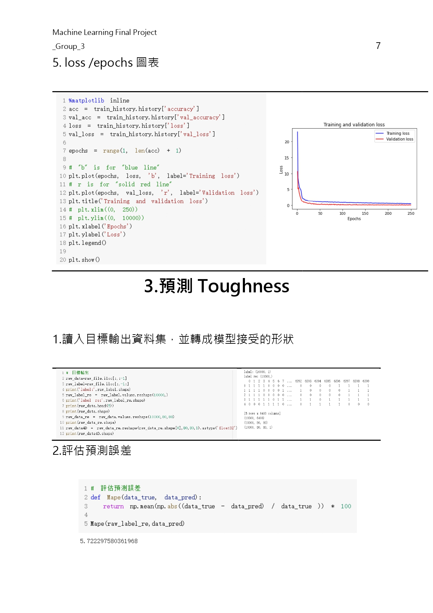
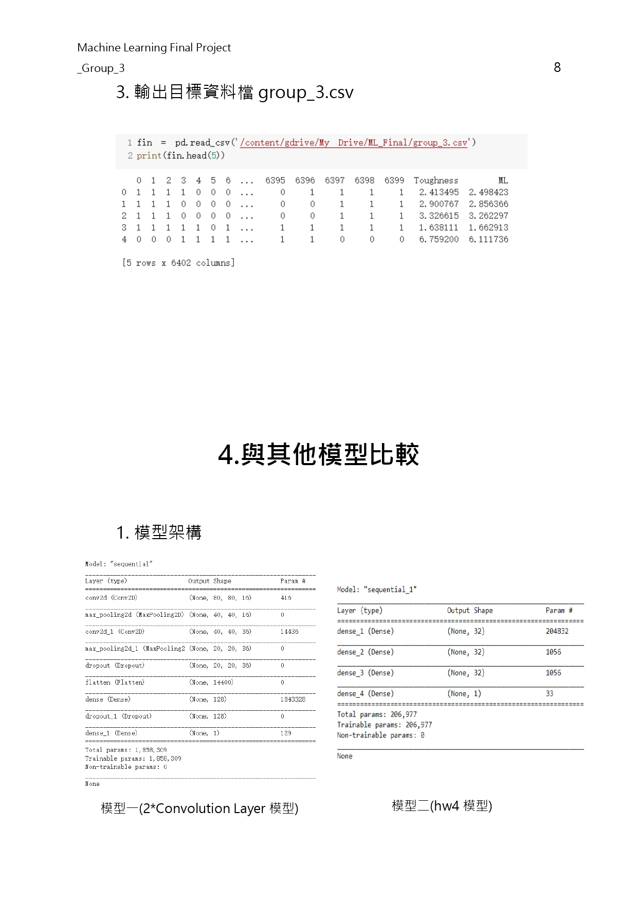
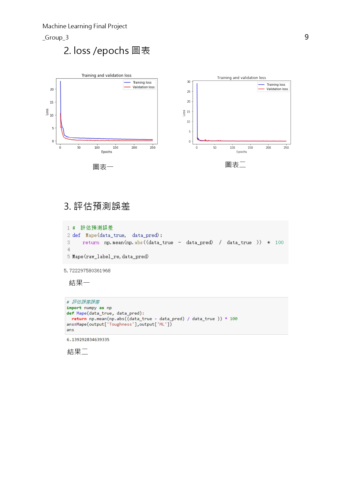
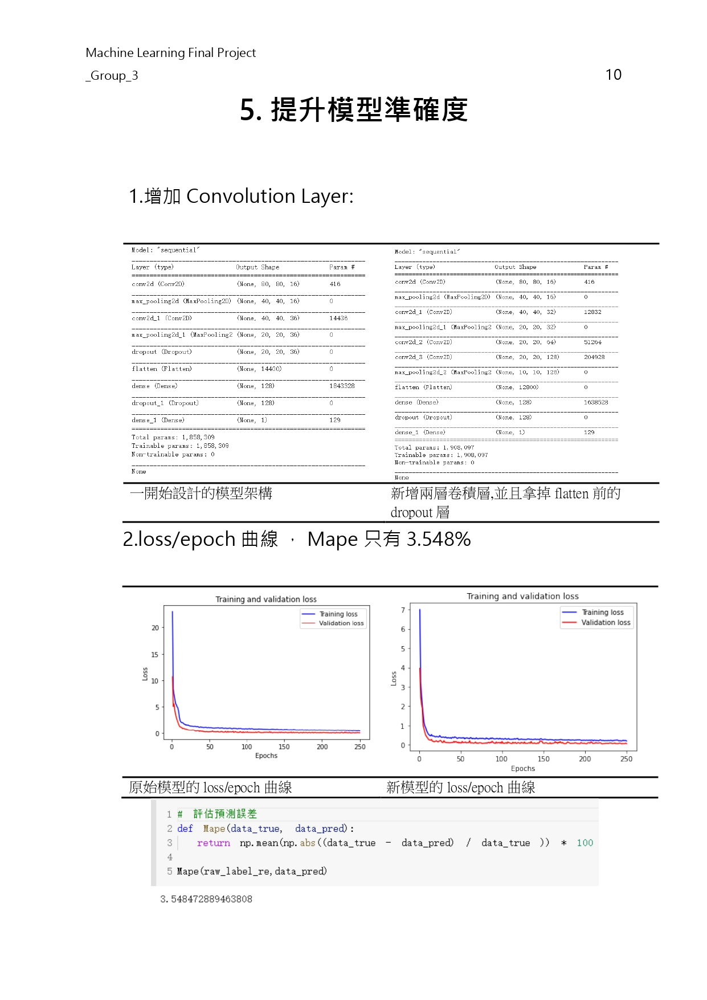
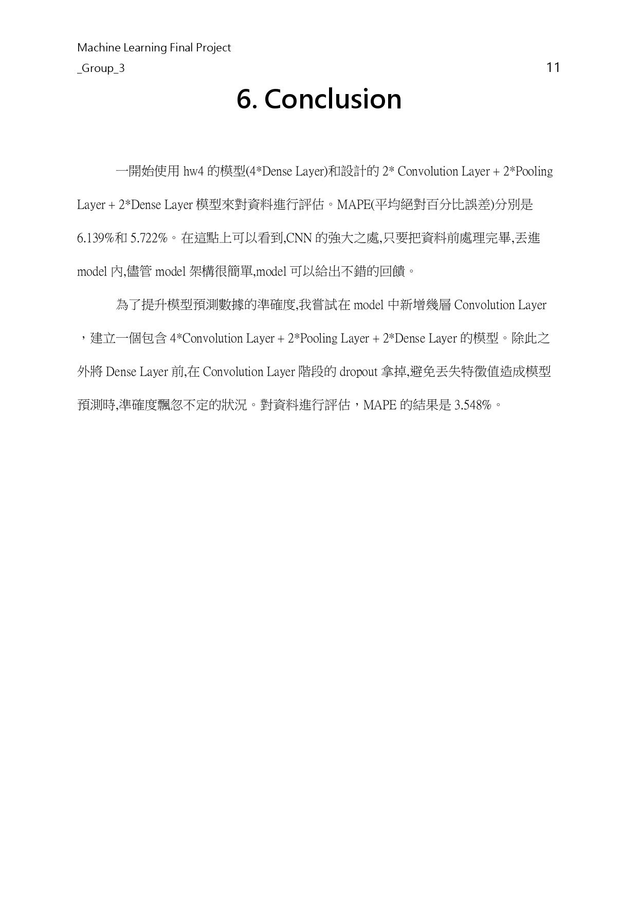

<!-- # ML_NeuralNetworks
Using Neural Networks to Predict Toughness

\+ -- code
 |   + --1_imgto80.py
 |   + --2_data2mat.py
 |   + --3_datapreprocess.py
 |   + --4_modell4xDense.py
 |   + --5_model2xConvolution .py
 |   + --6_model4xConvolution .py
\+ -- data
 |   + -- all_geo.txt
 |   + -- strength.txt
 |   + -- toughness.txt
 |   + -- fin_train.csv
\+ -- output
 |   + -- initial.h5
 |   + -- Train250.h5
 |   + -- TreasureHistoryDict
 \+ -- 4xConvolution
  |   + -- group_3.csv
 \+ -- 2xConvolution
  |   + -- group_3.csv
\+ -- group_3.csv
\+ -- group_3.zip
\+ -- group_3_re.zip
\+ -- ML_Final_group3.pdf

* code/1_imgto80.py          - 轉圖(80,灰階)
* code/2_data2mat.py         - 生成目標mat檔案
* code/3_datapreprocess.py   - 合成all_geo 和 tougheness.txt
* code/4_modell4xDense.py    -建構2層dense模型 
* code/5_model2xConvolution.py  - 建構2層卷積模型 ,輸出結果
* code/6_model4xConvolution .py - 建構4層卷積模型 ,輸出結果
* data/all_geo.txt           - 1w張圖的矩陣
* data/strength.txt          - 材質強度
* data/toughness.txt         - 材質韌性
* data/fin_train.csv         - all_geo 和 tougheness.txt合成的csv
* output/ initial.h5         - 訓練前模型
* output/ Train250.h5        - 訓練後模型
* output/TreasureHistoryDict - 訓練後歷史紀錄
* output/4xConvolution/group_3.csv   -5_model4xConvolution .py輸出的目標檔案
* output/2xConvolution/group_3.csv   -4_model2xConvolution .py輸出的目標檔案
* group_3.csv                - 目標輸出檔案
* group_3.zip                - 原始圖片
* group_3_re.zip             - 80*80灰階圖片
* ML_Final_group3.pdf        - 報告 -->

